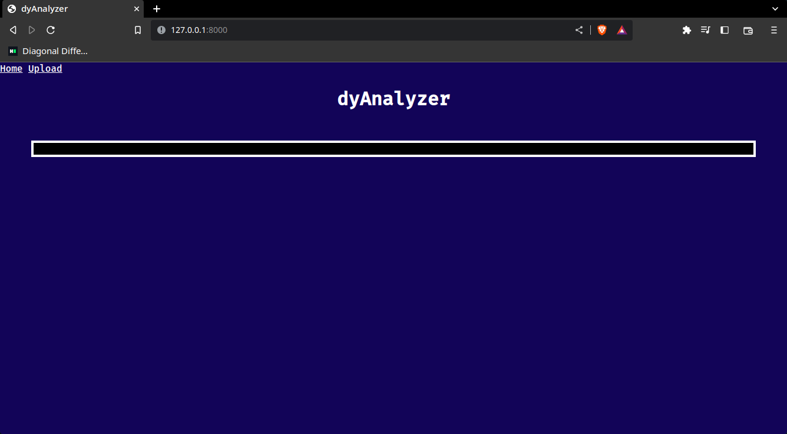
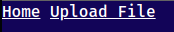
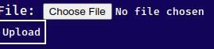
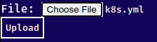
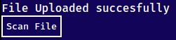
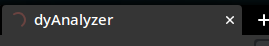
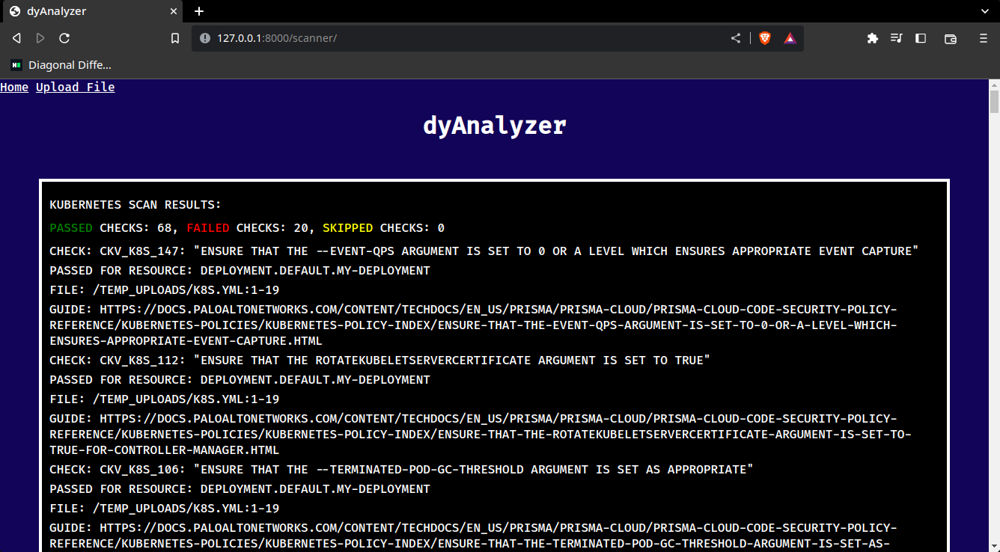

# DYAnalyzer

## Como ejecutar el proyecto?

1. Clonar el repositorio

```bash
git clone https://github.com/FelipeArredond/DYAnalyzer.git
```

1. Acceder a la carpeta del proyecto clonado, crear el venv y activarlo

```bash
cd DYAnalyzer
python3 -m venv venv
source venv/bin/activate
```

1. Una vez activado el venv instalamos las dependencias

```bash
pip install -r requirements.txt
```

1. Iniciar el servidor de la app

```bash
python3 manage.py runserver
```

## Funcionamiento

Acceder a la url [http://127.0.0.1:8000/](http://127.0.0.1:8000/)

Alli encontraremos la ventana inicial ⇒ 



En la esquina superior izquierda iremos a “ Upload File ” para cargar el archivo que deseemos realizar el analisis



Seleccionaremos un archivo y lo cargaremos con el boton upload



Cuando cargamos el archivo deberiamos de poder ver el nombre del archivo



Cuando presionamos en upload deberiamos poder ver el siguiente mensaje



Cuano presionamos el boton “ Scan File ” el backend de la app empezara a realizar el analisis, veremos que el navegador empezara a cargar, esto significa que se esta procesando la peticion



Al finalizar el escaneo podremos ver el output del analisis por pantalla



# Benchmark

## Methodology

Se contemplaron las siguientes herramientas para realizar el analisis:

- Trivy

[GitHub - aquasecurity/trivy: Find vulnerabilities, misconfigurations, secrets, SBOM in containers, Kubernetes, code repositories, clouds and more](https://github.com/aquasecurity/trivy)

- Grype

[GitHub - anchore/grype: A vulnerability scanner for container images and filesystems](https://github.com/anchore/grype)

- Checkov

[GitHub - bridgecrewio/checkov: Prevent cloud misconfigurations and find vulnerabilities during build-time in infrastructure as code, container images and open source packages with Checkov by Bridgecrew.](https://github.com/bridgecrewio/checkov)

- CoGuard

[GitHub - coguardio/coguard-cli: The CoGuard CLI Tool](https://github.com/coguardio/coguard-cli)

Se realizaron la siguiente prueba:

1. Creacion del proyecto en django.
2. Test del uso del escaner desde una web app.
3. Test del uso del escaner desde un ECS en AWS.

## Results

### Trivy

| Targets | Dependencias | Scanners |
| --- | --- | --- |
| - Container Image
- Filesystem
- Git Repository 
- Virtual Machine Image
- Kubernetes
- AWS | docker ( en el host ) | - OS packages and software dependencies in use
- Known vulnerabilities (CVEs)
- IaC issues and misconfigurations
- Sensitive information and secrets
- Software licenses |

### Grype

| Targets | Dependencias | Scanners |
| --- | --- | --- |
| - Container Image
- Filesystem
- Kubernetes | docker ( en el host ) | - OS packages and software dependencies in use    - Sensitive information and secrets                               - Known vulnerabilities                            |

### Checkov

| Targets | Dependencias | Scanners |
| --- | --- | --- |
| - Container Image
- Filesystem
- Kubernetes                      - Terraform                      - AWS | python3  ( en el host ) | - OS packages and software dependencies in use
- Known vulnerabilities (CVEs)
- IaC issues and misconfigurations
- Sensitive information and secrets
- Software licenses |

### CoGuard

| Targets | Dependencias | Scanners |
| --- | --- | --- |
| - Container Image
- Repository                      - Cloud config ( AWS, Azure, GCP ) | python3  ( en el host ) | - OS packages and software dependencies in use
- IaC issues and misconfigurations
- Sensitive information and secrets |

## Conclusion

Basado en el tiempo establecido para la prueba , la facilidad de implementacion, y los resultados obtenidos en el analisis se opto por usar la herramienta **CHECKOV** ya que su unica dependencia es que el host tenga python3 y realiza un analisis mas a profundidad que **CoGuard**.

En el caso donde se tenga docker instalado en el host, el tiempo de escaneo de los archivos es bastante mayor debido a que la app debe realizar ejecuciones con docker en el host como lo es “ docker pull bitnami/trivy  ” y ejecutar “ docker run image bitnami/trivy ”.